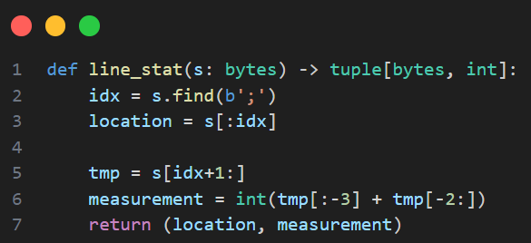
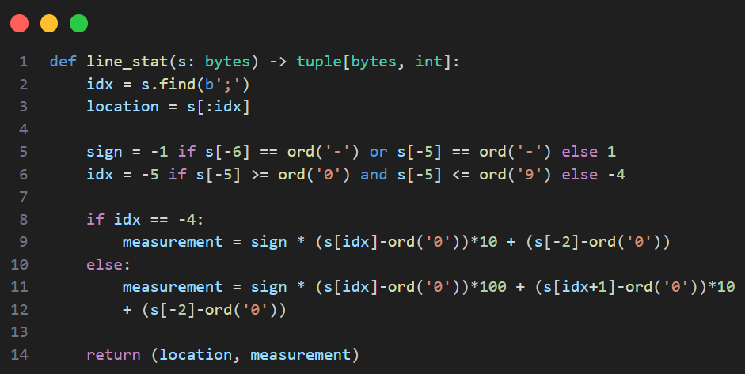

# Tối ưu code
## Bước 1: Đọc file ở chế độ byte thay vì unicode


Ảnh này có thể không bỏ vào cũng được, nếu bỏ vào highlight chỗ location.decode('utf-8').


Việc đọc ghi file ở chế độ byte giúp tăng thời gian thực thi rất đáng kể.
`Thêm hình ảnh minh chứng tốc độ trước và sau khi chỉnh sửa.`

Lý do:
+ Không cần giải mã (decoding)
  + Khi đọc ở chế độ byte (mode('rb')), dữ liệu được đọc dưới dạng byte thô mà không qua bất kỳ bước chuyển đổi nào.
  + Khi đọc ở chế độ unicode ('r' hoặc 'rt'), Python cần phải giải mã từng byte trong file thành các ký tự Unicode. Quá trình này tốn thời gian vì Python phải:
    + Phân tích từng chuỗi byte theo quy tắc mã hóa UTF-8.
    + Ghép các byte thành ký tự Unicode phù hợp.
+ UTF-8 mã hóa một ký tự khoảng từ 1 -> 4 bytes (1 cho ký tự ASCII, nhiều byte hơn cho các ký tự phức tạp)
    Khi giải mã, Python cần phải xác định số byte cần thiết cho mỗi ký tự, ghép lại và sau đó mới giải mã.
    -> Làm chậm tốc độ.
+  Tối ưu hóa I/O
   + Khi đọc file ở chế độ byte, Python thực hiện ít thao tác xử lý hơn, tập trung vào việc đọc dữ liệu từ ổ đĩa, dẫn đến tốc độ I/O nhanh hơn.
   + Ở chế độ Unicode, tốc độ I/O bị ảnh hưởng bởi việc giải mã dữ liệu ngay trong quá trình đọc.

**Kết luận**
> Chế độ byte nhanh hơn vì nó bỏ qua bước giải mã và làm việc trực tiếp với dữ liệu thô, tránh được các chi phí xử lý bổ sung mà chế độ Unicode cần thực hiện.

## Bước 2: Sử dụng memory mapping thay vì đọc từng dòng
File dữ liệu có đến 1 tỷ dòng, trong khi đó tốc độ đọc ghi trên file luôn luôn chậm hơn rất nhiều so với tốc độ xử lý của CPU.  
-> Cần giảm thiểu số lần đọc dữ liệu trực tiếp từ bộ nhớ.

### Memory mapping là gì?
**Memory mapping** (ánh xạ bộ nhớ) là một kỹ thuật trong lập trình cho phép ánh xạ một phần hoặc toàn bộ một file vào một vùng nhớ ảo của quá trình. Điều này có nghĩa là, thay vì đọc dữ liệu từ file vào bộ nhớ một cách tuần tự, bạn có thể truy cập trực tiếp vào dữ liệu trong file như thể nó đang nằm trong bộ nhớ của chương trình.

**Cơ chế hoạt động:**

* `Tạo vùng nhớ ảo`: Khi thực hiện memory mapping, hệ điều hành sẽ tạo ra một vùng nhớ ảo có kích thước bằng với kích thước của phần file mà bạn muốn ánh xạ.
* `Liên kết với file`: Vùng nhớ ảo này được liên kết với một vị trí cụ thể trong file.
* `Truy cập dữ liệu`: Khi bạn truy cập vào một địa chỉ trong vùng nhớ ảo, hệ điều hành sẽ tự động đọc dữ liệu tương ứng từ file vào bộ nhớ vật lý.

**Ưu điểm:**
* `Hiệu suất`: Truy cập dữ liệu nhanh hơn nhiều so với đọc từ đĩa.
* `Dễ sử dụng`: Cú pháp đơn giản, dễ hiểu.
* `Truy cập ngẫu nhiên`: Có thể truy cập bất kỳ phần nào của file một cách nhanh chóng.
* `Tiết kiệm bộ nhớ`: Chỉ cần ánh xạ phần dữ liệu cần thiết vào bộ nhớ.
  
**Nhược điểm:**
* `Tiêu thụ bộ nhớ`: Nếu ánh xạ toàn bộ file vào bộ nhớ, có thể gây ra tình trạng thiếu bộ nhớ.
* `Phức tạp hơn`: Cần hiểu rõ về quản lý bộ nhớ và các khái niệm liên quan.

From: 
To: 

So sánh hiệu suất: <Thêm hình ảnh>

## Bước 3: Lưu nhiệt độ bằng kiểu int thay vì float
From: 
```python
location, measurement = line.split(b";")
measurement = float(measurement)
```

To:
```python
location, s = line.split(b";")
measurement = int(s[:-3] + s[-2:])
```

Việc sử dụng kiểu int nhanh hơn so với để ở kiểu float vì:
+ Chuyển đổi kiểu dữ liệu nhanh hơn: khi ép kiểu sang float thì Python phải xác định phần nguyên và phần thập phân, ngoài ra cần xử lý thêm số mũ (nếu có).
  Vd: 1.23e4
+ Độ chính xác số học: Khi làm việc với số thực (float), Python phải xử lý các vấn đề liên quan đến độ chính xác số học, làm tăng thời gian tính toán.

So sánh hiệu suất: <Thêm hình ảnh>

## Bước 4: Dùng hàm find thay vì split
From: 

To: 


Hàm find(';') có tốc độ nhanh hơn split(';') bởi vì:
+ Hàm find sau khi tìm được vị trí ký tự ';' đầu tiên sẽ dừng lại và chỉ trả về 1 số nguyên là vị trí tìm được.
+ Hàm split cần duyệt toàn bộ chuỗi để kiểm tra tất cả vị trí ';', sau đó tách và gán giá trị vào danh sách.

## Bước 5: Đọc nhiệt độ thủ công (không ép kiểu)
From: 

To: 

Bước tối ưu cuối này có những điểm sau:
+ Đọc trực tiếp từ s, không tạo thêm xâu mới
+ Xử lý trực tiếp trên byte
  + Tiết kiệm thời gian, bộ nhớ cho việc tách chuỗi
  + Không cần sử dụng đến hàm int(), hàm int() để ép kiểu cần các thao tác như kiểm tra hợp lệ, xử lý dấu, chuyển từ mã ASCII -> số nguyên => tốc độ chậm hơn